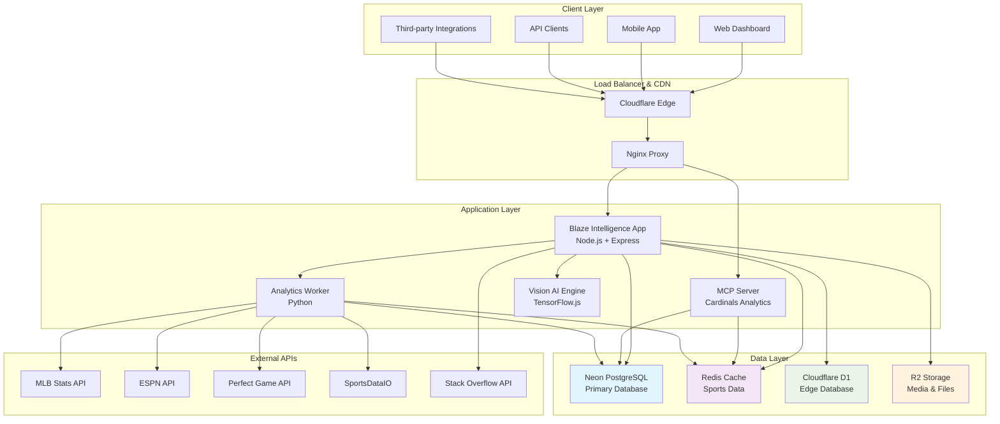
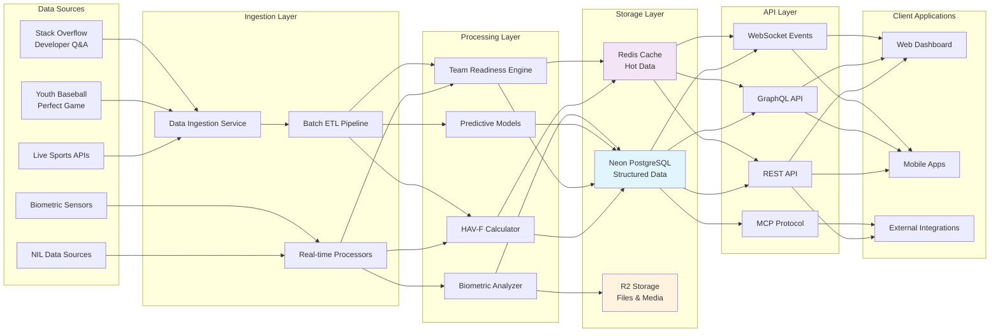
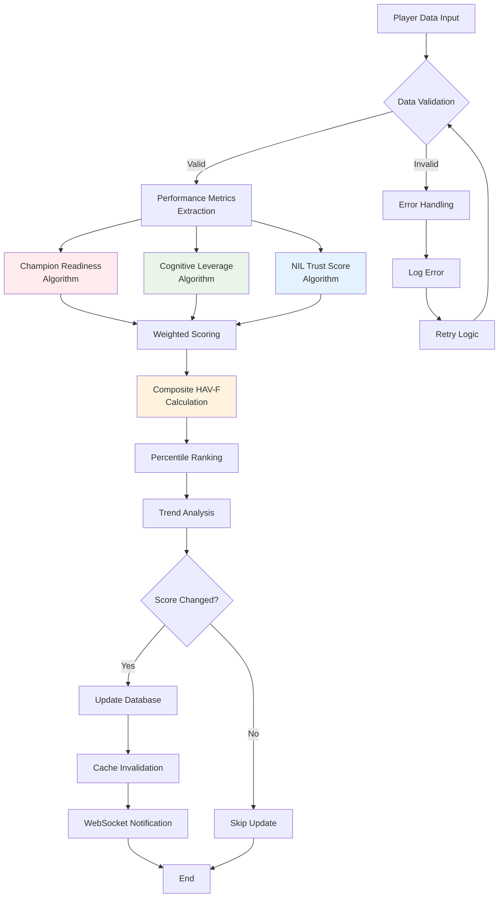
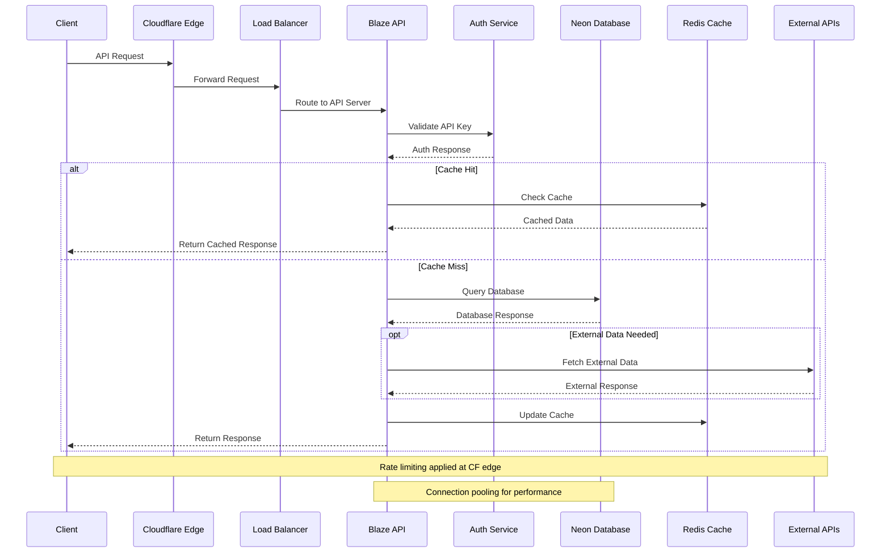
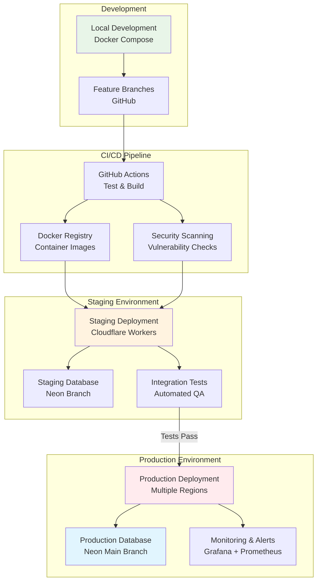
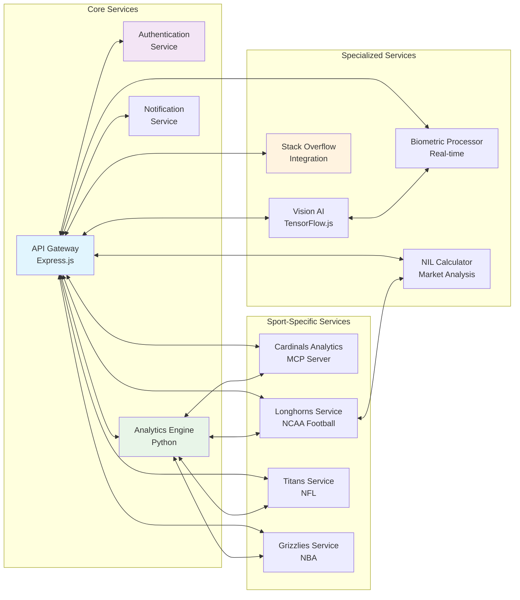
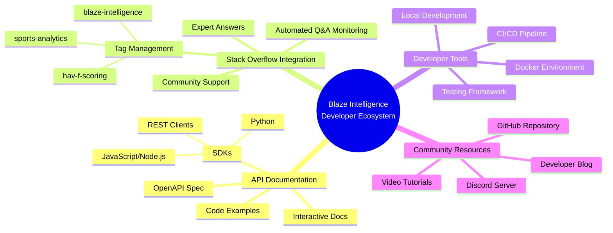
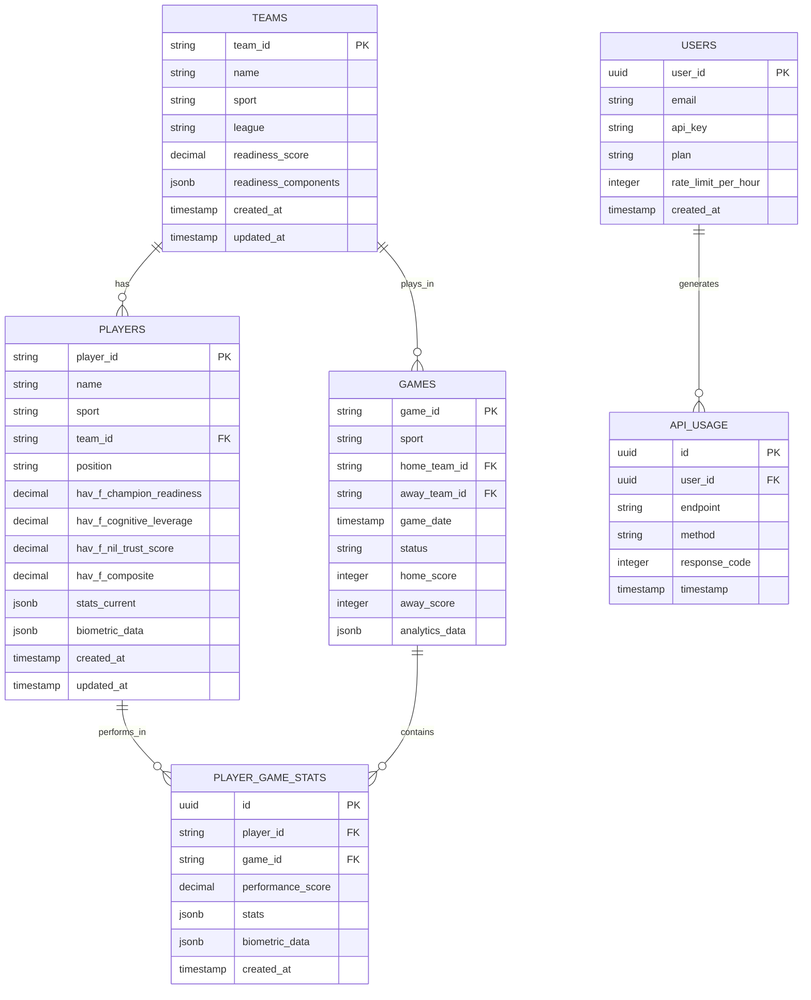
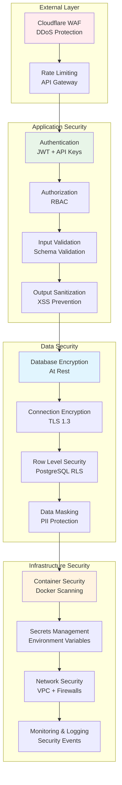
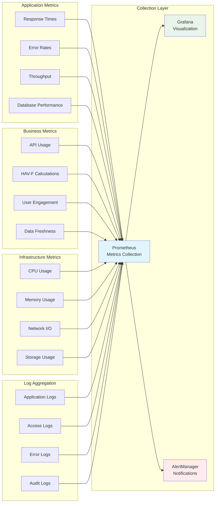

# Blaze Intelligence System Architecture Diagrams

This document contains Mermaid charts visualizing the Blaze Intelligence platform architecture, data flows, and system components.

## High-Level System Architecture

## Data Flow Architecture

## HAV-F Calculation Pipeline

## API Request Flow

## Deployment Architecture

## Microservices Communication

## Developer Support Ecosystem

## Data Model Relationships

## Security Architecture

## Monitoring & Observability

